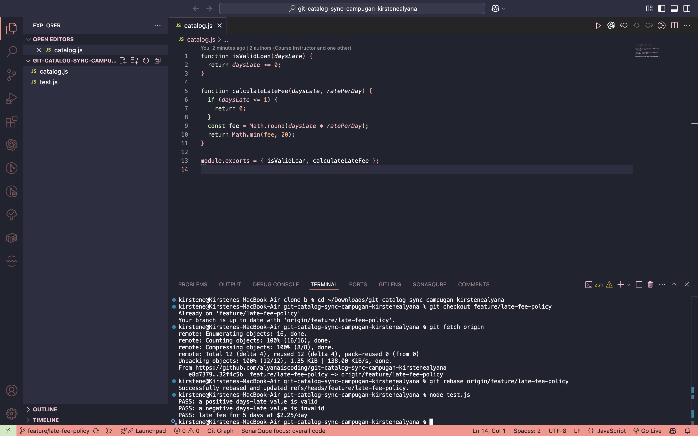
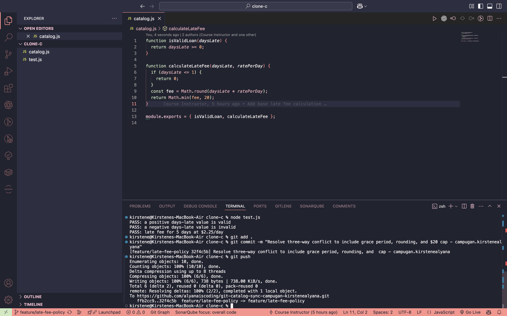
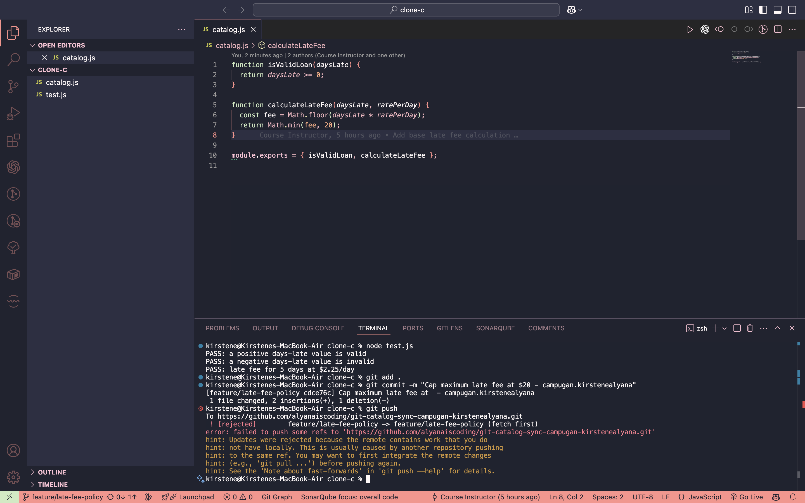
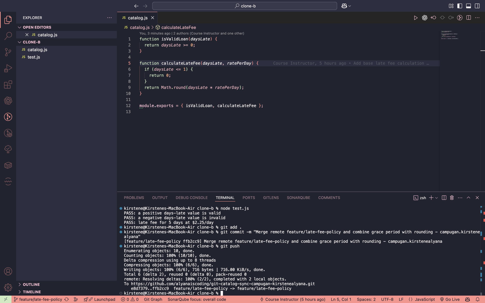
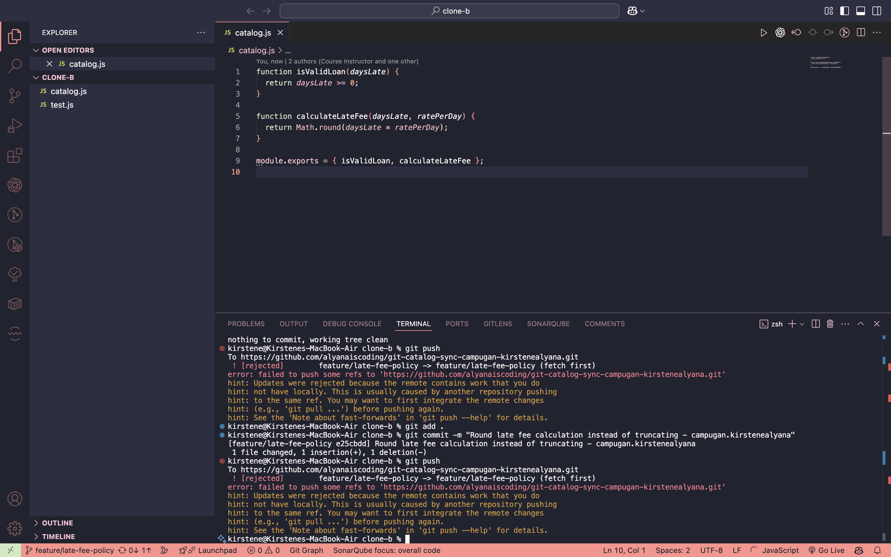
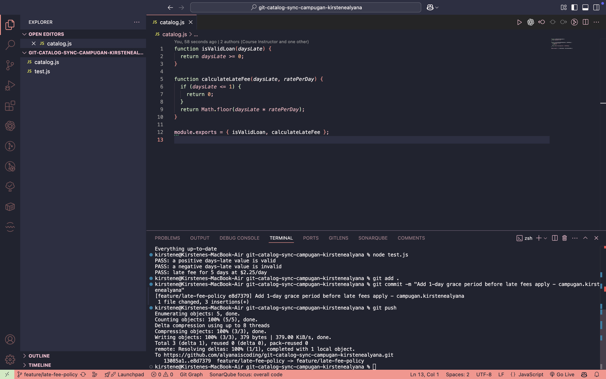
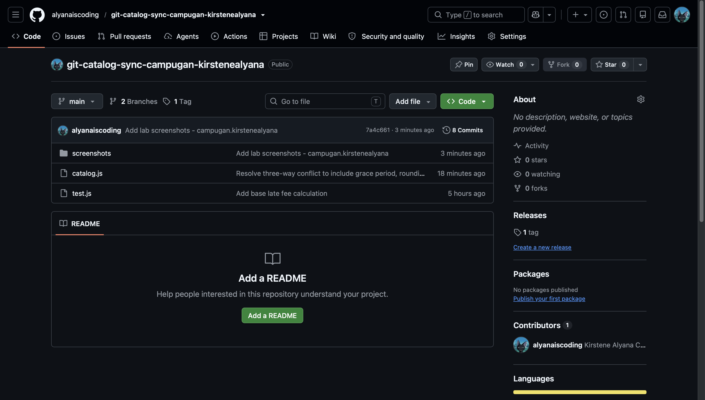

# Git Catalog Sync Documentation

## Task 1: Grace Period Implementation

## Task 2: Fee Rounding & Rejected Push

## Task 3: Merge Conflict Resolution

## Task 4: Fee Cap & Rejected Push

## Task 5: Three-Way Merge Resolution

## Task 6: Rebase Synchronization

## Task 7: Final GitHub Repository View

---

## Reflection Answers

### 1. Code Attribution in `calculateLateFee`
* **Grace Period (`if (daysLate <= 1) return 0;`)**: Added by Contributor 1 (Clone A) in Task 1.
* **Fee Rounding (`Math.round(...)`)**: Added by Contributor 2 (Clone B) in Task 2.
* **Maximum Fee Cap (`Math.min(fee, 20)`)**: Added by Contributor 3 (Clone C) in Task 4.
* **Minimum Fee (`Math.max(1, ...)`)**: Added by Contributor 1 (Clone A) in Task 6.

### 2. Task 3 (2-Way) vs. Task 5 (3-Way) Conflicts
Task 3 only involved reconciling two divergent code changes (Grace period and Rounding) where line overlaps were straightforward. Task 5 was harder because Clone C had been isolated since the initial commit; its base was outdated by two consecutive pushes. Resolving the three-way conflict required manually inspecting and blending all three logic branches simultaneously without dropping any contributor's rules or breaking test cases.

### 3. Task 5 (Merge) vs. Task 6 (Rebase)
In Task 5, `git merge` created a distinct merge commit that preserved the exact non-linear history and branching tree where Clone C diverged. In Task 6, `git rebase` rewrote Clone A's local commit history by re-applying local commits one by one on top of `origin/feature/late-fee-policy`, creating a clean, linear commit history without merge commits.

### 4. Process Change to Prevent Rejected Pushes
The team should adopt a **"Pull/Fetch before pushing"** policy, accompanied by regular communication (or working on isolated short-lived feature branches linked to Pull Requests). Pulling or rebasing remote changes before committing locally prevents concurrent pushes to the same remote branch from colliding.